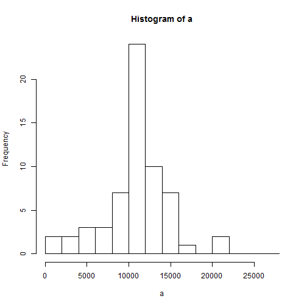

##Loading and preprocessing the data
Import data into R as a variable named "data"

```r
data<-read.csv("activity.csv")
data$date<-as.Date(data$date,"%Y-%m-%d")
```
      

##What is mean total number of steps taken per day?

Histogram of total steps taken per day

```r
datasplit<-split(data,data$date)
a<-lapply(datasplit,function(x){sum(data.frame(x)$steps)})
a<-as.numeric(a)
hist(a,breaks=c(0:14)*2000)
```


```r
datamean<-mean(a,na.rm=T)
datamedian<-median(a,na.rm=T)
```
The mean and median of the total number of steps taken per day are 10766 and 10765 respectively.      

##What is the average daily activity pattern?
Time series plot of the 5-minute intervals averaged over all the days is plotted below


```r
stepsavg<-NULL
for (count in 1:288){
stepsavg[count]<-mean(as.numeric(data[(c(1:61)*288)-288+count,1]),na.rm=T)
}

plot(stepsavg,type="l",ylab="Average of steps in that interval", xaxt = "n",xlab="")
```


```r
ans<-which(stepsavg==max(stepsavg))
```
The 5-minute interval, on average across all the days in the dataset, that contains the maximum number of steps is calculated to be 104 using the above formula


##Imputing missing values

The total number of missing values in the dataset is given by the code below

```r
length(data$steps[is.na(data$steps)])
```

```
## [1] 2304
```

The strategy for filling in the missing values will be to use the average value for the -minute interval

```r
stepsmedian<-NULL
dataNoNA<-data

for (count in 1:288){
stepsmedian[count]<-median(as.numeric(data[(c(1:61)*288)-288+count,1]),na.rm=T)
}

for (count1 in 1:288){
  for (count2 in 1:61){
    if(is.na(data[count1+(288*(count2-1)),1])){
      dataNoNA[count1+(288*(count2-1)),1]<-stepsavg[count1]
    }
  }
}
```
Histogram of total steps taken per day using imputed values


```r
datasplit<-split(dataNoNA,data$date)
a<-lapply(datasplit,function(x){sum(data.frame(x)$steps)})
a<-as.numeric(a)
hist(a,breaks=c(0:14)*2000)
```




```r
datamean<-mean(a,na.rm=T)
datamedian<-median(a,na.rm=T)
```
The mean and median of the total number of steps taken per day are 10766 and 10766 respectively which is same from when NA values were disregarded. Depending on the imputed values used the estimate of the total daily number of steps might increase or stay the same.


##Are there differences in activity patterns between weekdays and weekends?

The below code adds the factor variable weekend to the imported data

```r
newfactor<-NULL  
for (count in 1:17568 ) {
  day=weekdays(data[count,2])
  if (day=="Monday" || day=="Tuesday" || day=="Wednesday" || day=="Thursday" || day=="Friday"){
    newfactor[count]<-"weekday"
  }else {
      newfactor[count]<-"weekend"
    }
  
}

dataWFactor<-cbind(data,newfactor)
```


Plot is below

```r
datasplit<-split(dataWFactor,dataWFactor$newfactor)
dataWeekday<-datasplit[[1]]
dataWeekend<-datasplit[[2]]                    

stepsavgWeekday<-NULL
stepsavgWeekend<-NULL

for (count in 1:288){
stepsavgWeekday[count]<-mean(as.numeric(data[(c(1:45)*288)-288+count,1]),na.rm=T)
stepsavgWeekend[count]<-mean(as.numeric(data[(c(1:16)*288)-288+count,1]),na.rm=T)
}


par(mfrow=c(2,1))

plot(stepsavgWeekday,type="l",ylab="Steps", xaxt = "n",xlab="",main="Weekday")
plot(stepsavgWeekend,type="l",ylab="Steps", xaxt = "n",xlab="",main="weekend")
```


